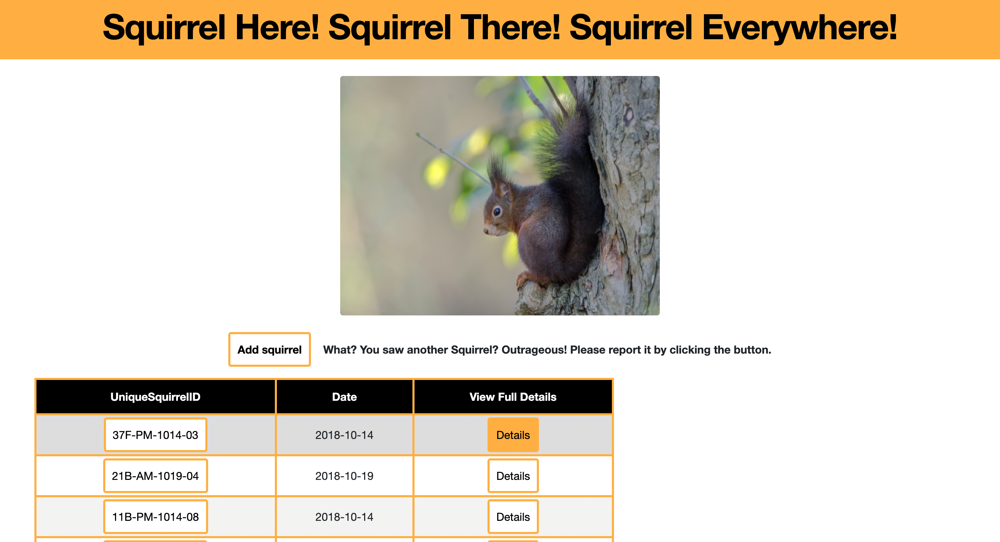
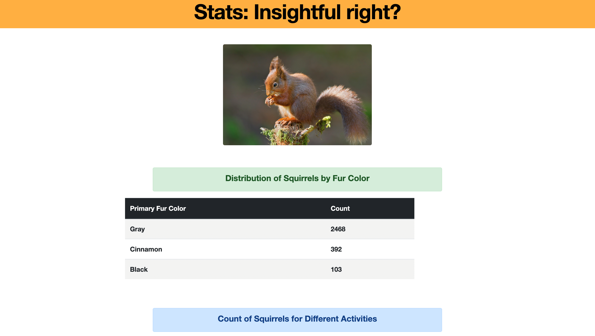
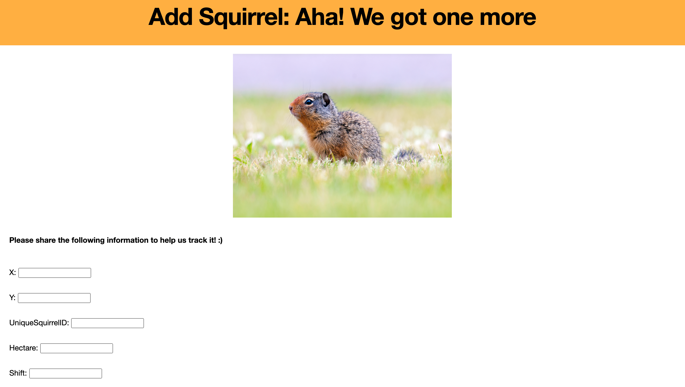
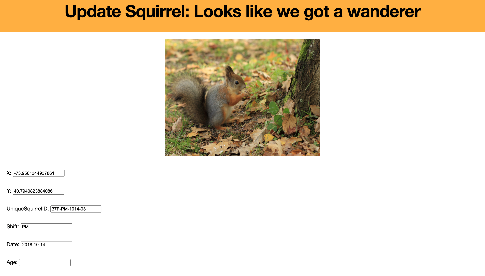
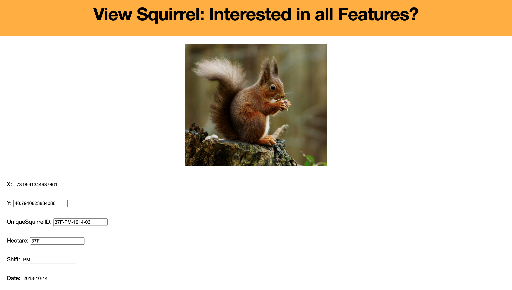

# Squirrel Tracker: Web-based visual application

## Introduction 
Django, a Python-based free and open-source web framework that follows the model-template-views architectural pattern, is used to construct a Web-based visual application **Squirrel Tracker** 


The project aims to provide with visualization of sightings of squirrels found in Central Park, Manhattan, New York. Along with additional features like adding or modifying existing squirrel data

## Background
Eccentric billionaire Joffrey Hosencratz just purchased the web development company you work for. You’ve met him once in an elevator and he was impressed with your skill in developing web applications with the ``Django`` framework. He also relayed that his most recent trip to Sedona, AZ has left him in a bit of trouble. See, he fancies the show Rick and Morty and a particular scene coupled with a traumatic childhood squirrel experience and a bad crystal bath experience in Sedona as left him wanting. 


He would like to start keeping track of all the known squirrels and plans to start with Central Park. He’s asked you to build an application that can import the 2018 Central Park Squirrel Census data and allow his team to add, update, and view squirrel data. 

## DataSet
Dataset used to visualize sightings was from the source,[**2018 Central Park Squirrel Census**](https://data.cityofnewyork.us/api/views/vfnx-vebw/rows.csv)
This data set contains features like location, Age, color, Activities etc.

## Dependencies
- [Python 3.6+](https://www.python.org/)
- [Django==3.1.7](https://www.djangoproject.com)
- [Django-Leaflet](https://django-leaflet.readthedocs.io/en/latest/)

## Management Commands
Import: A command that can be used to import the data from the 2018 census file (in CSV format). The file path should be specified at the command line after the name of the management command.

```sh
python manage.py import_squirrel_data squirrel_data.csv
```

Export: A command that can be used to export the data in CSV format. The file path should be specified at the command line after the name of the management command. 

```sh
python manage.py export_squirrel_data squirrel_csv.csv
```

## API

### Map View    
<p align="center"></p>

### Sightings 
<p align="center"></p>

### Stats of squirrels
<p align="center"></p>

### Add squirrels
<p align="center"></p>

### Edit a specific squirrel
<p align="center"></p>

### View All details of a Squirrel
<p align="center"></p>

## Contributors

Shlok Sethia 

Aashi Malhotra

[**Visit**](https://github.com/shloksethia-6119/project) our Squirrel Tracker Web-based visual application page for more information.

## Documentation
The official description for this project is in 
[**Squirrel Tracker**](https://docs.google.com/document/d/1SPv3fMDKiemrR86rD-S9ecvI2npz3PljDzwCfxK2x5g/edit)
